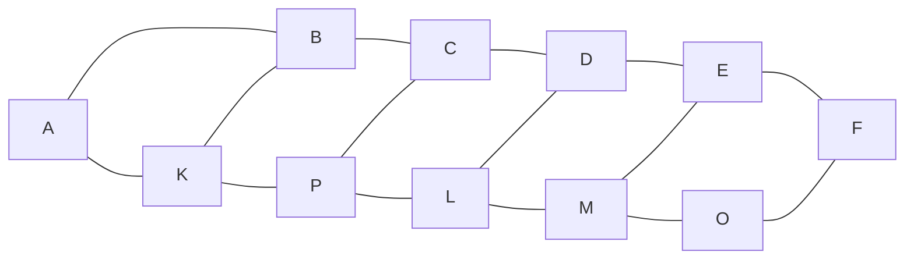

# Применение теории графов для анализа связности рецензентов научного журнала

## Описание проекта
Построен граф, вершины которого представляют собой рецензентов научного журнала, а ребра связи между ними в процессе работы над статьями. Анализируются характеристики графа и их предельные значения. Построены остовные деревья графа ближайщих соседей, характеризующие связи рецензента в случае подбора замены.

## Лицензия

Этот проект распространяется под лицензией [CC BY-NC](https://creativecommons.org/licenses/by-nc/4.0/) (Creative Commons Attribution-NonCommercial).

## Цели проекта
1. Определить все связи рецензента с целью подбора ему замены.
2. На основании характеристик графа определить количественные показатели минимального количества связей рецензентов.

## "Инструменты" проекта
- язык `R`
- теория графов (связность, степень вершины, длина пути);
- математическая статистика (оценка математического ожидания, дисперсии, распределения выборки);
- комбинаторика;
- метод Монте-Карло (построение распределений с заданными параметрами);
- линейная регрессия.

## Интересный результат
В процессе проекта выяснилось, что диаметр графа стремится к числу 6, что потверждает гипотезу шести рукопожатий ([Теория шести рукопожатий](https://www.science.org/doi/10.1126/science.1081058))

## Результаты проекта

1. Граф связей редакционной коллегии:
    * Связан большую часть эволюции;
    * Имеет:
        * диаметр соответствующий гипотезе шести рукожатий;
        * распределение степени вершин близкое к треугольному или показательному;
        * нормальное распределение длин путей между вершинами;
        * линейно возрастающее среднее количество связей между рецензентами при эволюции, но остающиеся примерно на порядок меньше максимального количества связей полного графа.
2. Можно найти замену рецензенту его по остовному дереву графа ближайщих соседей.
3. Вопрос исключения из редакционной коллегии рецензентов с малым количеством связей (вплоть до концевой вершины) дискуссионый и зависит от выбранного способа оценки получаемого распределения.

Публикации
1. [О связях в науке на примере редакционной коллегии научного журнала](https://doi.org/10.24108/2658-3143-2021-4-1-2-19-28)
2. [Дополнение к статье «О связях в науке на примере редакционной коллегии научного журнала»
](https://doi.org/10.24108/2658-3143-2022-5-1-2)
